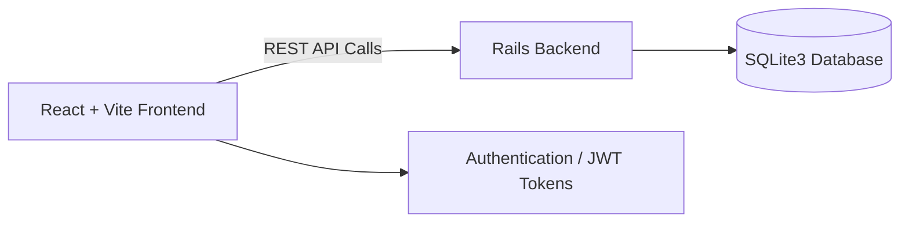

# 🛍️ React + Vite E-Commerce

> A sleek and modern clothing store built with **React + Vite**, seamlessly integrated with a full **Rails backend** for real data, authentication, and order management.

---


## ✨ Overview

This project is a **complete e-commerce web application** where users can:

- Browse clothing collections 👕  
- Add items to their cart 🛒  
- Create an account & log in 🔐  
- Place orders 📦  
- Fetch and persist data via a **Rails API backend**  

It’s fast ⚡ and responsive 📱
---

## 🚀 Features

| Category | Description |
|-----------|-------------|
| 🛒 **Cart System** | Add, update, and remove items in a persistent cart |
| 👤 **User Auth** | Secure login, signup, and session management |
| 📦 **Order Processing** | Send real orders to the backend |
| 🧥 **Product Catalog** | Browse items by type, category, or collection |
| 🎨 **Modern UI** | Built with Tailwind CSS for a clean, responsive layout |
| ⚡ **Super Fast** | Powered by Vite + React for instant updates |

---

## 🖼️ Preview


---

## 🧩 Tech Stack

| Frontend | Backend | Tools |
|-----------|----------|-------|
| React + Vite | Ruby on Rails | Axios |
| Tailwind CSS | SQLite3 | ESLint + Prettier |
| React Router | JWT Auth | 

---

## 🧠 Architecture


## ⚙️ Setup
1️⃣ Clone Repositories
```bash
# Frontend
git clone https://github.com/tedyAA/ecommerce-app
cd ecommerce-app

# Backend
View how to setup the backend at https://github.com/tedyAA/rails-ecommerce-backend.git
```
2️⃣ Install Dependencies

```bash
npm install
```

3️⃣ Start the App

```bash
npm run dev
```
Frontend runs on http://localhost:5173
